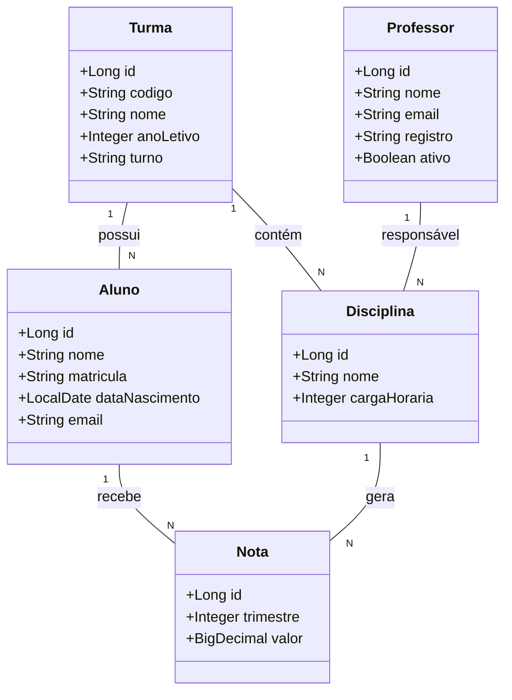

# diario_escolar
📘 Descrição do Projeto

Este projeto consiste no desenvolvimento de uma API RESTful para gerenciamento de um diário escolar. A aplicação permite o cadastro e a administração de alunos, professores, turmas, disciplinas e notas, oferecendo uma solução organizada e escalável para o controle acadêmico.

Cada turma é composta por alunos e associada a um professor responsável. A API possibilita o lançamento, atualização e consulta de notas dos alunos por turma, além da determinação automática do status acadêmico, indicando se o aluno foi aprovado ou reprovado conforme critérios definidos.

O sistema implementa controle de permissões, garantindo que apenas professores possam cadastrar e editar notas, enquanto os alunos possuem acesso restrito à visualização de suas informações acadêmicas.

A aplicação segue os princípios da arquitetura REST, utilizando:

Endpoints bem definidos

Operações CRUD

Comunicação via JSON

Separação clara de responsabilidades entre as camadas (Controller, Service, Repository)

Essa abordagem torna a API adequada para integração com diferentes aplicações cliente, como frontends web ou mobile, mantendo boas práticas de desenvolvimento backend.

O Figma foi utilizado para a abstração do domínio desta API, sendo útil na análise e projeto da solução.

## Diagrama de Classes (Domínio da API)

