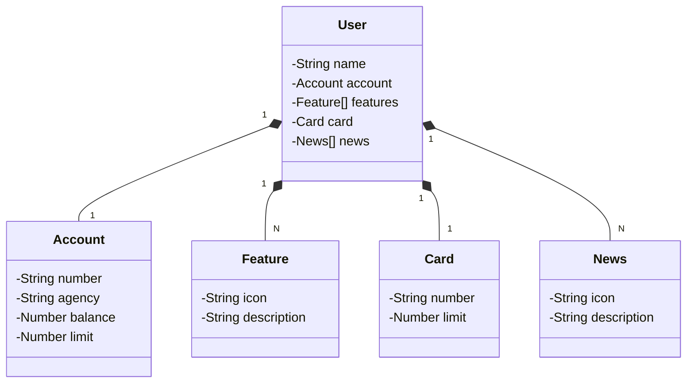

# diario_escolar
Um simples diário escolar onde existem turmas que cotém alunos e um professor, neste diário será possível adicionar notas para os alunos em cada turma e determinar se foram aprovados ou reprovados. Somente o professor pode editar notas dos alunos, enquanto os alunos podem somente vizualizar.

O Figma foi utilizado para a abstração do domínio desta API, sendo útil na análise e projeto da solução.

## Diagrama de Classes (Domínio da API)

